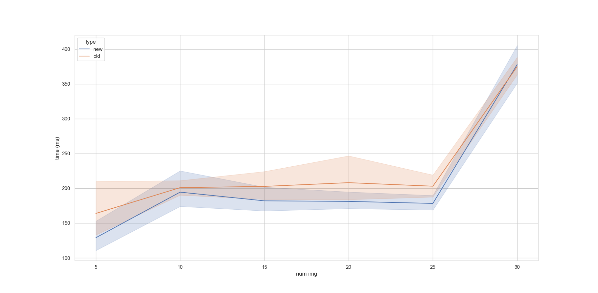

# 2024-09-23 - Flattened Temporal Convolutions
[7b0ea7b](https://github.com/ForceLightning/I2R_Sep24_Apr25_Internship/7b0ea7b910b4faa302a7308eb9c050c2b624b154)

Implemented options to set flat temporal convolutional layers for the 2+1 model. For example, if the original script had a convolutional layer stack of filters with (\[input\] → kernel 1 → kernel 2 → ... → \[output\]) ([\30\] → 5 → 3 → 2 → \[1\]) we had instead (\[30\] → 30 → \[1\])

| Flattened Conv layers? | Validation Loss | Dice (Macro Avg.) | Dice (Weighted Avg.) | Dice Class 1 | Dice Class 2 | Dice Class 3 | Runtime  |
| ---------------------- | --------------- | ----------------- | -------------------- | ------------ | ------------ | ------------ | -------- |
| No                     | 0.3996          | 0.4011            | 0.4897               | 0.5792       | 0.3646       | 0.2494       | 1.693 hr |
| Yes                    | 0.3883          | 0.4061            | 0.5203               | 0.6040       | 0.3866       | 0.2276       | 1.009 hr |

# 2024-09-20 - Data augmentation
[d8c3633](https://github.com/ForceLightning/I2R_Sep24_Apr25_Internship/d8c3633276a509eea16a940efb57fbf64fad84bd)

Adding simple image transforms such as `RandomRotation` to be applied to all LGE, Cine, and Masks for each sample together allows the model to be more robust when learning image features. This is facilitated by the `torchvision.transforms.v2` module, with the usage of `tv_tensors` to wrap image and mask tensors for operations. The performance difference for the LGE task is as shown below:


A comparison on the LGE, Cine, and TwoPlusOne tasks are as follows:

| Task | Data Augmented? | Validation Loss | Dice (Macro Avg.) | Dice (Weighted Avg.) | Dice Class 1 | Dice Class 2 | Dice Class 3 |
| ---- | --------------- | --------------- | ----------------- | -------------------- | ------------ | ------------ | ------------ |
| LGE  | No              | 0.3641          | 0.5075            | 0.4429               | 0.7736       | 0.2312       | 0.5177       |
| LGE  | Yes             | 0.2277          | 0.7461            | 0.7919               | 0.8206       | 0.6827       | 0.7352       |
| Cine | No              | 0.4331          | 0.4853            | 0.5977               | 0.6909       | 0.3912       | 0.3737       |
| Cine | Yes             | 0.4099          | 0.5358            | 0.5974               | 0.6866       | 0.4123       | 0.5085       |
| 2+1  | No              | 0.3855          | 0.4398            | 0.5540               | 0.6897       | 0.3357       | 0.2940       |
| 2+1  | Yes             | 0.3996          | 0.4011            | 0.4897               | 0.5792       | 0.3646       | 0.2594       |

# 2024-09-20 - Replaced OpenCV dataloading with Pillow methods
[52b468b](https://github.com/ForceLightning/I2R_Sep24_Apr25_Internship/52b468b243652c8ec7884b7a687cdf2ab746a4f3)

The original script used OpenCV methods to load the data, which takes a significant amount of time when loading multi-frame .TIFF files in the Cine task. Instead, we may use Pillow's lazily loaded Image objects which tie-in nicely with `torchvision`'s transform methods. The speedup for the Cine task is as shown below:

| Implementation | `__getitem__` time | Time saved |
| -------------- | ---------------- | ---------- |
| Original       | 171 ms ± 786 μs  |            |
| Pillow         | 67.9 ms ± 600 μs | -39.70%    |

This includes image transformations, where the Pillow implementation includes an additional transform on the combined Cine images and mask, so that transformations like rotations and elastic transform can be applied together.

# 2024-09-16 - Loading images as greyscale
[318b1fe](https://github.com/ForceLightning/I2R_Sep24_Apr25_Internship/commit/318b1fea00f42bb918bb91580f440868ed2c4789)

The original script had all images load as RGB. This resulted in a larger than desired amount of image data to be passed through the model, especially for those that load 30 frames of data. If instead of 3 channels for (R, G, B) we allow for the loading of just 1 channel, we to save on $\frac{2}{3}$ of the VRAM required for each batch.

# 2024-09-16 - Conv1D without flattening in TwoPlusOne
[e4b9b3e](https://github.com/ForceLightning/I2R_Sep24_Apr25_Internship/commit/e4b9b3ee258f1c9a9b86ae73805380f881f1f95a)

The current method involves lots of reordering and reshaping operations:

| Operation | Count |
| --------- | ----- |
| Permute   | 3     |
| Flatten   | 2     |
| Unflatten | 2     |

Instead of flattening the input tensor to shape $(B, 1, H \times W \times C \times F)$ where
- $B$ is the batch size
- $H$ is the height of the tensor
- $W$ is the width of the tensor
- $C$ is the number of channels of the tensor
- $F$ is the number of frames of the tensor
is it possible to pass the tensors as $(B, ..., C, F)$?

## Initial conclusion
Not feasible, if we want the Conv1D layer to not mutate the channels. However, we may be able to save a few clock cycles on all the shape mutations.

This code block can completely replace the `compress_2` function (tested to provide the same results as the original).
```py
def new_compress_2(stacked_outputs: torch.Tensor, block: OneD):
    # Input shape: (B, F, C, H, W).
    b, f, c, h, w = stacked_outputs.shape
    # Reshape to: (B, H, W, C, F).
    inputs = stacked_outputs.permute(0, 3, 4, 2, 1).contiguous()
    # Inputs to a Conv1D must be of shape (N, C_in, L_in).
    inputs = inputs.view(b * h * w * c, 1, f)
    # Outputs are of shape (B * H * W * C, C_out)
    out = block(inputs)
    # Take the mean over the channel dimension -> (B * H * W * C, 1) and squeeze
    out = out.mean(dim=1).squeeze(dim=1)
    # Return outputs to shape (B, H, W, C) -> (B, C, H, W)
    final_out = out.view(b, h, w, c).permute(0, 3, 1, 2)

    return final_out
```

| Operation | Original count | New count |
| --------- | -------------- | --------- |
| Permute   | 3              | 2         |
| Flatten   | 2              | 0         |
| Unflatten | 2              | 0         |



# 2024-09-14 Removed for-loops in `__getitem__` of CINE images
[797bef8](https://github.com/ForceLightning/I2R_Sep24_Apr25_Internship/commit/797bef88a1ab15001b7ba4a738cfdb383f30d501)

The previous implementation used for-loops to stack CINE images that are loaded from `cv2.imreadmulti` which probably needs to allocate new memory for each time the call to `np.dstack` is made. Replacing this with torch and numpy methods we can reduce the processing time by ≈23.6%. This has the added benefit of not requiring a rotation at the end as the transformations are done in-place.

| Original Method<br><br>Avg $\pm$ Std<br>(Min/Max) | New Method<br><br>Avg $\pm$ Std<br>(Min/Max) | Diff in % |
| ------------------------------------------------- | -------------------------------------------- | --------- |
| 153.25ms $\pm$ 184.99ms<br>106.102ms / 1.436s     | 117.11ms $\pm$ 4.51ms<br>105.23ms / 125.52ms | -23.58%   |
# 2024-09-13 Unit Tests
[f0deaf3](https://github.com/ForceLightning/I2R_Sep24_Apr25_Internship/commit/f0deaf3cdeffc3b32e874e1af0e2eac084b10dcf)

Some basic unit tests were implemented to ensure that changes made in development do not affect whether a script is able to run or not.

# 2024-09-13 - DataLoader `num_workers`
[f0deaf3](https://github.com/ForceLightning/I2R_Sep24_Apr25_Internship/commit/f0deaf3cdeffc3b32e874e1af0e2eac084b10dcf)

The original implementation used a `num_workers` value of `0`. Setting `num_workers` for DataLoader instantiation to any value above `0` results in new threads being spawned to load the data. This helps in increasing the data throughput from the system’s drive to GPU memory as long as the CPU can prepare the next batch of data before the GPU completes computation on the current batch. This leads to higher GPU utilisation and lower training/inference time at the cost of a significant delay in starting the scripts ($\approx 30$ s).

# 2024-09-12 - Vectorised metrics implementation
[58c403a](https://github.com/ForceLightning/I2R_Sep24_Apr25_Internship/commit/58c403ab0e7765099a676c582a125e07fe01f30f)

The original implementation for calculating the Dice coefficient used extensive for-loops, which are known to be [much slower than vectorised implementations](https://stackoverflow.com/questions/51549363/for-loop-vs-numpy-vectorization-computation-time). By reducing the for-loop computational overhead by vectorising the calculations, we can then calculate them at low cost during the training and validation loops. Additionally, the original implementation only works with a batch size of 1, while the vectorised implementation can handle an arbitrary number for batch size, as long as they are able to be kept in memory. These operations can also be performed on the GPU, massively increasing the calculation speed.


# 2024-09-11 - Multilabel v. Multiclass metrics
[d9f4f93](https://github.com/ForceLightning/I2R_Sep24_Apr25_Internship/commit/d9f4f932bd0c5b37e0a02cc9246f4e227c44e4f8)

The original implementation used multiclass training loss and multilabel evaluation (using a threshold). The classification problem is somewhere in between multiclass and multilabel:
```math
\text{class}_{3} \subset \text{class}_{2},
\text{class}_{2} \subset \text{class}_{1},
\text{class}_{1} \cap \text{bg} = \emptyset
```
# 2024-09-09 - Automatic Mixed Precision (AMP)
[c8a35ed](https://github.com/ForceLightning/I2R_Sep24_Apr25_Internship/commit/c8a35ed67a32f7f1c23a0b55e712604e401bbf98)

The PyTorch Lightning module allows this to be an easy inclusion during training.

The original implementation used full precision 32-bit floating point numbers for mathematical operations. On NVIDIA GPUs, automatic mixed precision is supported to cast `float32` tensors to `bfloat16`, which can decrease memory pressure on the GPU’s VRAM while also increasing the computational throughput of the card (see [this reply](https://github.com/huggingface/transformers/issues/14608#issuecomment-1001259427) to a GitHub issue).

